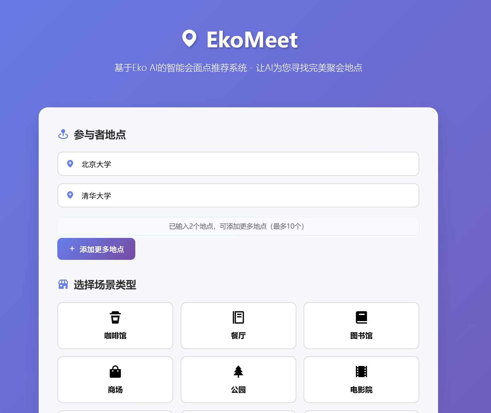
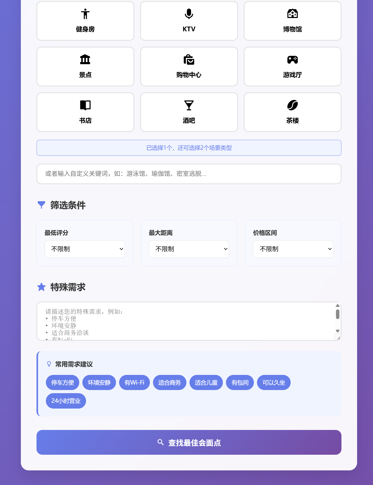
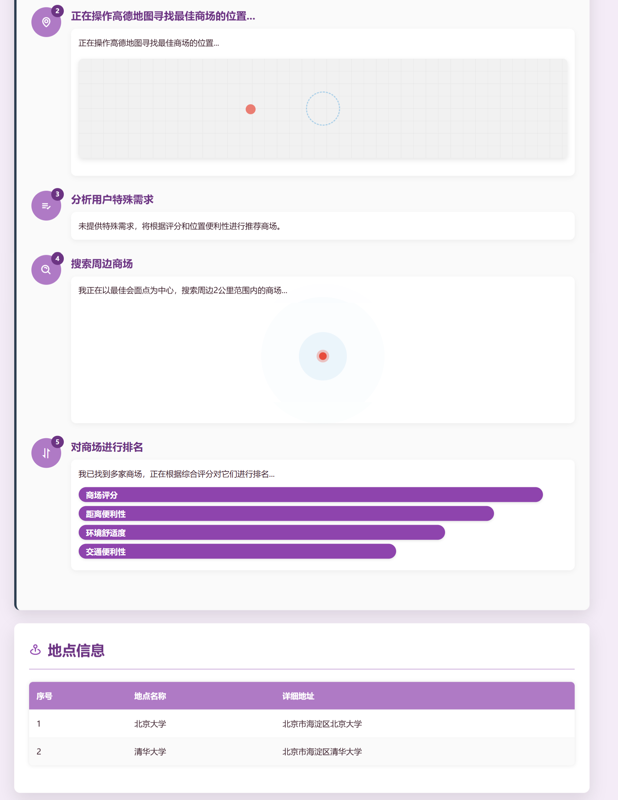
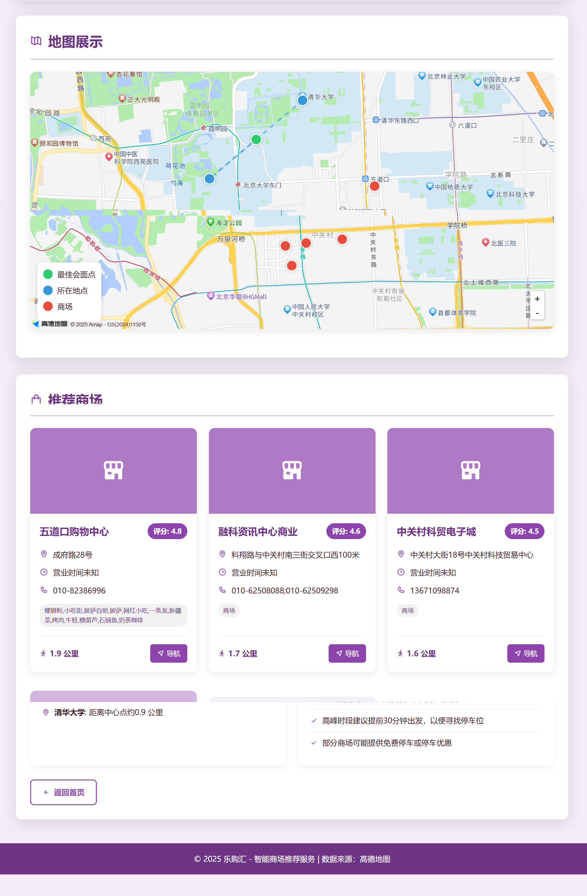

<div align="center">

# 🚀 EkoMeet



**AI-Powered Meeting Spot Recommendation System**

Intelligent meeting point recommendation system based on Eko AI framework, featuring multi-agent collaboration and natural language-driven location suggestions.

[](https://opensource.org/licenses/MIT)
[](https://www.python.org/downloads/)
[](https://fastapi.tiangolo.com/)
[](https://github.com/FellouAI/eko)

🎯 **AI-Driven Intelligence** | 🤖 **Multi-Agent Architecture** | 🌐 **Natural Language Interface**

</div>

## ✨ Core Features

- 🤖 **Multi-Agent Intelligence** - Distributed AI architecture based on Eko framework
- 🌍 **Smart Geographic Analysis** - Integrated with Amap API for precise location calculations
- 💬 **Natural Language Interaction** - Describe needs in simple language, AI understands intelligently
- 🎯 **Personalized Recommendations** - Smart ranking algorithm based on user preferences
- 📱 **Responsive Interface** - Modern UI adapted for PC and mobile devices
- ⚡ **Real-time Processing** - Asynchronous processing for fast responses

## 🏗️ Technical Architecture

```
Frontend (HTML/CSS/JS) 
    ↓
FastAPI Backend
    ↓
Eko AI Framework
    ↓
Multi-Agent System
    ↓
- LocationAgent (Geographic Processing)
- POISearchAgent (Venue Search)  
- RecommendationAgent (Smart Recommendations)
- VisualizationAgent (Result Visualization)
```

## 🛠️ Tech Stack

- **Backend**: Python + FastAPI
- **AI Framework**: Eko AI Framework
- **LLM**: OpenRouter (Claude-3.5-Sonnet)
- **Map Services**: Amap (Gaode Map) API
- **Frontend**: HTML5 + CSS3 + JavaScript
- **Type System**: TypeScript (Tool Development)

<div align="center">

### Main Interface


### Multi-Venue Selection


### Recommendation Results


### Detailed Information


</div>

## 🌟 Features

EkoMeet is an intelligent meeting point recommendation system that calculates optimal meeting locations based on multiple participants' geographical positions and recommends nearby venues.

### ✨ Key Features

- 🎯 **Smart Center Point Calculation**: Calculate geometric center based on multiple locations for fairness
- 🏢 **Multi-Scenario Recommendations**: Search multiple venue types simultaneously (cafes + restaurants + libraries)
- 📍 **Multi-Location Support**: Support 2-10 participant locations
- 🎨 **Intuitive User Interface**: Modern responsive design
- 🚀 **Real-time Recommendations**: Generate personalized recommendations quickly
- 📊 **Intelligent Ranking**: Comprehensive sorting based on ratings, distance, and user requirements

### 🔥 Latest Enhancements

- ✅ **Multi-Scenario Recommendations**: Support simultaneous selection of multiple venue types
- ✅ **Frontend Multi-Selection**: Intuitive venue type selection interface
- ✅ **Smart Ranking Algorithm**: Scenario matching reward mechanism
- ✅ **Performance Monitoring**: Complete performance statistics and health checks
- ✅ **Error Handling**: Robust exception handling mechanism

## 🚀 Quick Start

### Requirements

- Python 3.11+
- Amap (Gaode Map) API Key
- Modern browsers (Chrome, Firefox, Safari, Edge)

### Installation

1. **Clone Repository**
```bash
git clone https://github.com/JasonRobertDestiny/EkoMeet.git
cd EkoMeet
```

2. **Install Dependencies**
```bash
pip install -r requirements.txt
```

3. **Configure API Key**
```bash
cp config/config.toml.example config/config.toml
```

Edit `config/config.toml` and add your Amap API key:
```toml
[amap]
api_key = "your_amap_api_key_here"
```

4. **Start Service**
```bash
python web_server.py
```

5. **Access Application**
Open browser and visit: http://127.0.0.1:8000

## 📱 Usage

### Basic Usage

1. **Input Locations**: Add 2-10 participant locations
2. **Select Scenarios**: Choose 1-3 venue types (cafes, restaurants, libraries, etc.)
3. **Set Requirements**: Add special requirements (convenient parking, quiet environment, etc.)
4. **Get Recommendations**: Click search to get intelligent recommendations

### Advanced Features

- **Multi-Scenario Combination**: Search "cafe restaurant" simultaneously for more options
- **Custom Keywords**: Enter special venue types like "escape room"
- **Filter Conditions**: Filter by rating, distance, price
- **Special Requirements**: Support parking, Wi-Fi, private rooms, etc.

## 🏗️ Technology Architecture

### Backend Stack

- **FastAPI**: High-performance web framework
- **Pydantic**: Data validation and settings management
- **aiohttp**: Async HTTP client
- **Amap API**: Geocoding and POI search

### Frontend Stack

- **HTML5 + CSS3**: Responsive design
- **Vanilla JavaScript**: Lightweight interaction
- **Boxicons**: Icon library
- **Modern UI Design**: Gradients and glass effects

### Core Algorithms

- **Geometric Center Calculation**: Multi-point centroid algorithm
- **Intelligent Ranking**: Multi-factor scoring system
- **Scenario Matching**: Keyword matching reward
- **Deduplication Algorithm**: Smart deduplication based on name and address

## 📊 API Documentation

### Main Endpoints

- `GET /` - Homepage redirect
- `POST /api/find_meetspot` - Meeting point recommendation
- `GET /health` - Health check
- `GET /workspace/js_src/{filename}` - Generated recommendation pages

### Request Example

```bash
curl -X POST "http://127.0.0.1:8000/api/find_meetspot" \
  -H "Content-Type: application/json" \
  -d '{
    "locations": ["Beijing University", "Tsinghua University"],
    "keywords": "cafe restaurant",
    "user_requirements": "convenient parking"
  }'
```

### Response Example

```json
{
  "success": true,
  "html_url": "/workspace/js_src/place_recommendation_20250624_12345678.html",
  "locations_count": 2,
  "keywords": "cafe restaurant",
  "processing_time": 0.52
}
```

## 🔧 Development

### Environment Setup

```bash
# Create virtual environment
python -m venv venv
source venv/bin/activate  # Linux/Mac
# or
venv\Scripts\activate     # Windows

# Install dependencies
pip install -r requirements.txt
```

### Code Standards

- Follow PEP8 Python coding standards
- Use type hints for better code documentation
- Write comprehensive docstrings
- Format code before committing

## 🚀 Deployment

### Local Development

```bash
# Start development server
python web_server.py

# Or using npm scripts
npm run dev
```

### Production Deployment

Supported deployment platforms:
- **Render**: Using `render.yaml` configuration
- **Railway**: Auto-detection deployment
- **Docker**: Containerized deployment
- **Traditional Server**: Using Nginx + Gunicorn

### Environment Variables

Required environment variables:
- `AMAP_API_KEY`: Amap (Gaode Map) API key
- `PORT`: Service port (default 8000)

Optional environment variables:
- `PYTHON_ENV`: Runtime environment (development/production)
- `LOG_LEVEL`: Logging level (default info)

## 🤝 Contributing

We welcome contributions of all kinds!

### How to Contribute

1. Fork the project
2. Create your feature branch (`git checkout -b feature/AmazingFeature`)
3. Commit your changes (`git commit -m 'Add some AmazingFeature'`)
4. Push to the branch (`git push origin feature/AmazingFeature`)
5. Open a Pull Request

### Bug Reports

If you find a bug or have a feature suggestion:
1. Check existing Issues
2. Create a detailed Issue description
3. Provide reproduction steps and environment info

## 📄 License

This project is licensed under the MIT License - see the [LICENSE](LICENSE) file for details.

## 📞 Contact

- **Project Link**: [https://github.com/JasonRobertDestiny/EkoMeet](https://github.com/JasonRobertDestiny/EkoMeet)
- **Bug Reports**: [Issues](https://github.com/JasonRobertDestiny/EkoMeet/issues)
- **Feature Requests**: [Discussions](https://github.com/JasonRobertDestiny/EkoMeet/discussions)

## 🙏 Acknowledgments

- [Eko AI Framework](https://github.com/FellouAI/eko) - Powerful AI framework support
- [Amap (Gaode Map) API](https://lbs.amap.com/) - Precise geographic information services
- [FastAPI](https://fastapi.tiangolo.com/) - Modern web framework
- [Boxicons](https://boxicons.com/) - Beautiful icon library

## 📈 Star History

[](https://www.star-history.com/#JasonRobertDestiny/EkoMeet&Date)

---

<div align="center">

**If this project helps you, please give it a ⭐️!**

</div>
